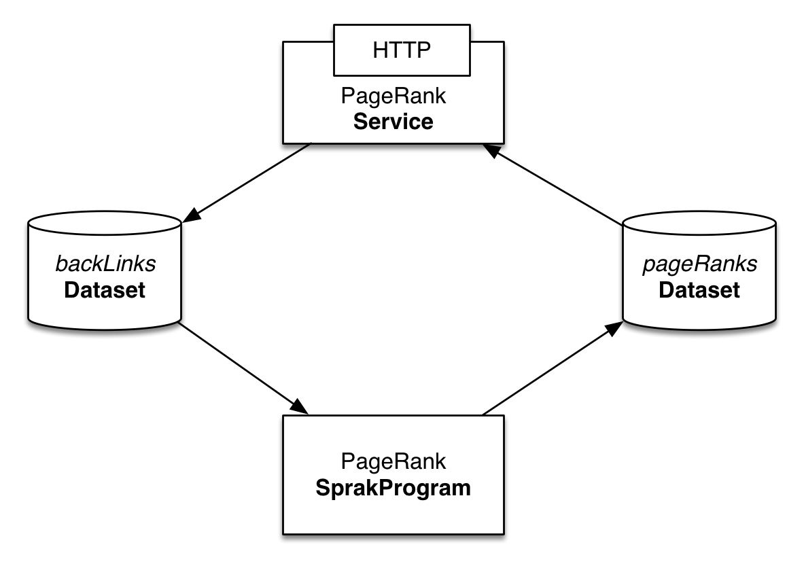

Iterative Data Processing with Apache Spark (Beta: Standalone Only)
====================================================================

`Apache Spark <https://spark.apache.org/>`_ is very popular engine to perform in-memory cluster computing for Hadoop. In this guide, you will learn how to run Apache Spark programs with CDAP.

What You Will Build
-------------------

You will build a `CDAP application <http://docs.cdap.io/cdap/current/en/dev-guide.html#applications>`_ that exposes REST API to take in web page’s backlinks information and serve out the `PageRank <http://en.wikipedia.org/wiki/PageRank>`_ for the known web pages. You will:

* Build a CDAP `Spark <http://docs.cdap.io/cdap/2.5.0/en/dev-guide.html#spark-beta-standalone-cdap-only>`_ program that computes PageRank of the web pages
* Build a `Service <http://docs.cdap.io/cdap/current/en/dev-guide.html#services>`_ to receive backlinks data and serve PageRank computation results over HTTP
* Persist and retrieve data in `Dataset <http://docs.cdap.io/cdap/current/en/dev-guide.html#datasets>`_ and use them as input for a Spark program.
* Use `Dataset <http://docs.cdap.io/cdap/current/en/dev-guide.html#datasets>`_ to store input data
* Use `Dataset <http://docs.cdap.io/cdap/current/en/dev-guide.html#datasets>`_ as input and output for Spark program

What You Will Need
------------------

* `JDK 6 or JDK 7 <http://www.oracle.com/technetwork/java/javase/downloads/index.html>`_
* `Apache Maven 3.0+ <http://maven.apache.org/>`_
* `CDAP SDK <http://docs.cdap.io/cdap/current/en/getstarted.html#download-and-setup>`_

Let’s Build It!
---------------

Following sections will guide you through building an application from scratch. 
If you are interested in deploying and running the application right away, you 
can clone its source code from this github repository. In that case feel 
free to skip the next two sections and jump right to Build & Run section.

Application Design
~~~~~~~~~~~~~~~~~~

Backlinks data is sent to PageRankService over HTTP (e.g. by web crawler as it processes web pages). The service persists the data into backLinks dataset upon receiving. The PageRank for known pages is computed periodically by a PageRankProgram. The program uses backLinks dataset as an input and persists results in pageRanks dataset. 

PageRankService then uses pageRanks dataset to serve PageRank for a given URL over HTTP.

In this guide we assume that backlinks data will be sent to CDAP application.

|(AppDesign)|

Implementation
~~~~~~~~~~~~~~

The first step is to get the application structure set up.  We will use a standard Maven project structure for all of the source code files::

  ./pom.xml
  ./src/main/java/co/cask/cdap/guides/PageRankApp.java
  ./src/main/java/co/cask/cdap/guides/PageRankSpark.java
  ./src/main/java/co/cask/cdap/guides/BackLinksHandler.java
  ./src/main/java/co/cask/cdap/guides/PageRankHandler.java
  ./src/main/scala/co/cask/cdap/guides/PageRankProgram.scala

The application is identified by the PageRankApp class.  This class extends 
`AbstractApplication <http://docs.cdap.io/cdap/2.5.0/en/javadocs/co/cask/cdap/api/app/AbstractApplication.html>`_,
and overrides the configure() method in order to define all of the application components:

.. code:: java

  public class PageRankApp extends AbstractApplication {
  
    @Override
    public void configure() {
      setName("PageRankApplication");
      addSpark(new PageRankSpark());
      addService("PageRankService", new ImmutableList.Builder<HttpServiceHandler>()
        .add(new BackLinksHandler())
        .add(new PageRankHandler())
        .build());
      try {
        ObjectStores.createObjectStore(getConfigurer(), "backLinks", String.class);
        ObjectStores.createObjectStore(getConfigurer(), "pageRanks", Double.class);
      } catch (UnsupportedTypeException e) {
        throw new RuntimeException("Will never happen: all classes above are supported", e);
      }
    }
  }

In this example we’ll use Scala to write a Spark program (for example of using Java refer to this `CDAP example <http://docs.cask.co/cdap/current/en/getstarted.html#sparkpagerank-application-example>`_). You’ll need to add scala and maven-scala-plugin as a dependency in your maven `pom.xml <https://github.com/cdap-guides/cdap-spark-guide/blob/develop/pom.xml>`_

The code below configures Spark in CDAP. This class extends `AbstractSpark <http://docs.cdap.io/cdap/current/en/javadocs/co/cask/cdap/api/spark/AbstractSpark.html>`_
and overrides the configure() method in order to define all of the components. The setMainClassName method sets Spark Program class.
which CDAP will run:

.. code:: java

  public class PageRankSpark extends AbstractSpark {

    @Override
    public SparkSpecification configure() {
      return SparkSpecification.Builder.with()
        .setName("PageRankProgram")
        .setDescription("Spark program to compute PageRank")
        .setMainClassName(PageRankProgram.class.getName())
        .build();
    }
  }

``BackLinksHandler`` receives backlinks info via POST to ``/backlink``. A valid backlink information is in the form of
two URLs separated by a whitespace. For example:

.. code::

  http://example.com/page1 http://example.com/page10
  
BackLinksHandler stores the backlink information in a Dataset as a String in the format specified above.

.. code:: java

  public class BackLinksHandler extends AbstractHttpServiceHandler {
  
    @UseDataSet("backLinks")
    private ObjectStore<String> backLinks;
  
    @Path("backlink")
    @POST
    public void handleBackLink(HttpServiceRequest request, HttpServiceResponder responder) {
  
      ByteBuffer requestContents = request.getContent();
  
      if (requestContents == null) {
        responder.sendError(HttpResponseStatus.NO_CONTENT.code(), "Request content is empty.");
        return;
      }
  
      if (parseAndStore(Charsets.UTF_8.decode(requestContents).toString().trim())) {
        responder.sendStatus(HttpResponseStatus.OK.code());
      } else {
        responder.sendError(HttpResponseStatus.BAD_REQUEST.code(), "Malformed backlink information");
      }
    }
  
    /**
     * Validates the format and stores the backlink information if valid
     *
     * @param bLink the request body
     * @return true if the backlink information is valid else false
     */
    private boolean parseAndStore(String bLink) {
      String[] backlinkURLs = bLink.split("\\s+");
      if (backlinkURLs.length == 2) {
        backLinks.write(bLink, bLink);
        return true;
      }
      return false;
    }
  }

PageRankProgram Spark program does the actual page rank computation. This code is taken from `Apache Spark's PageRank example <https://github.com/apache/spark/blob/master/examples/src/main/scala/org/apache/spark/examples/SparkPageRank.scala>`_:
The Spark program stores the computed PageRank in a Dataset where the key is the URL and the value is the computer PageRank.

.. code:: java

  class PageRankProgram extends ScalaSparkProgram {
  
    private final val ITERATIONS_COUNT: Int = 10
  
    override def run(sc: SparkContext) {
      val lines: RDD[(Array[Byte], String)] = sc.readFromDataset("backLinks", classOf[Array[Byte]], classOf[String])
      val links = lines.map { s =>
        val parts = s._2.split("\\s+")
        (parts(0), parts(1))
      }.distinct().groupByKey().cache()
  
      var ranks = links.mapValues(v => 1.0)
  
      // Calculate the PageRanks
      for (i <- 1 to ITERATIONS_COUNT) {
        val contribs = links.join(ranks).values.flatMap { case (urls, rank) =>
          val size = urls.size
          urls.map(url => (url, rank / size))
        }
        ranks = contribs.reduceByKey(_ + _).mapValues(0.15 + 0.85 * _)
      }
  
      val output = ranks.map(x => (Bytes.toBytes(x._1), x._2))
  
      sc.writeToDataset(output, "pageRanks", classOf[Array[Byte]], classOf[java.lang.Double])
    }
  }

To serve results out via HTTP let’s add PageRankHandler, which reads PageRank for a given URL from pageRanks dataset:

.. code:: java

  public class PageRankHandler extends AbstractHttpServiceHandler {
  
    @UseDataSet("pageRanks")
    private ObjectStore<Double> pageRanks;
  
    @Path("pagerank")
    @POST
    public void handleBackLink(HttpServiceRequest request, HttpServiceResponder responder) {
  
      ByteBuffer requestContents = request.getContent();
      if (requestContents == null) {
        responder.sendError(HttpResponseStatus.NO_CONTENT.code(), "No URL provided.");
        return;
      }
  
      String urlParam = Charsets.UTF_8.decode(requestContents).toString();
  
      Double rank = pageRanks.read(urlParam);
      if (rank == null) {
        responder.sendError(HttpResponseStatus.NOT_FOUND.code(), "The following URL was not found: " + urlParam);
        return;
      }
  
      responder.sendJson(String.valueOf(rank));
    }
  }

Build & Run
-----------

The PageRankApp application can be built and packaged using standard Apache Maven commands::

  mvn clean package
  
Note that the remaining commands assume that the cdap-cli.sh script is available on your PATH. If this is not the case, please add it::

  export PATH=$PATH:<CDAP home>/bin

You can then deploy the application to a standalone CDAP installation::

  cdap-cli.sh deploy app target/cdap-spark-guide-1.0.0.jar

Start the Service::

  cdap-cli.sh start service PageRankApp.PageRankService 

Send some Data::

  export BACKLINK_URL=http://localhost:10000/v2/apps/PageRankApp/services/PageRankService/methods/backlink

  curl -v -X POST -d 'http://example.com/page1 http://example.com/page1' $BACKLINK_URL  
  curl -v -X POST -d 'http://example.com/page1 http://example.com/page10' $BACKLINK_URL  
  curl -v -X POST -d 'http://example.com/page10 http://example.com/page10' $BACKLINK_URL  
  curl -v -X POST -d 'http://example.com/page10 http://example.com/page100' $BACKLINK_URL  
  curl -v -X POST -d 'http://example.com/page100 http://example.com/page100' $BACKLINK_URL

Run Spark Program::

  curl -v -X POST 'http://localhost:10000/v2/apps/PageRankApp/spark/PageRankProgram/start'
  
Spark Program can take sometime to complete. You can check the status for completion through::

  curl -v 'http://localhost:10000/v2/apps/PageRankApp/spark/PageRankProgram/status'

Query for PageRank results::

  curl -v -d 'http://example.com/page10' -X POST 'http://localhost:10000/v2/apps/PageRankApp/services/PageRankService/methods/pagerank'

Example output::

  0.45521228811700043

Congratulations!  You have now learned how to incorporate Spark data into your CDAP applications.  
Please continue to experiment and extend this sample application.

Share & Discuss
---------------

Have a question? Discuss at `CDAP User Mailing List <https://groups.google.com/forum/#!forum/cdap-user>`_

