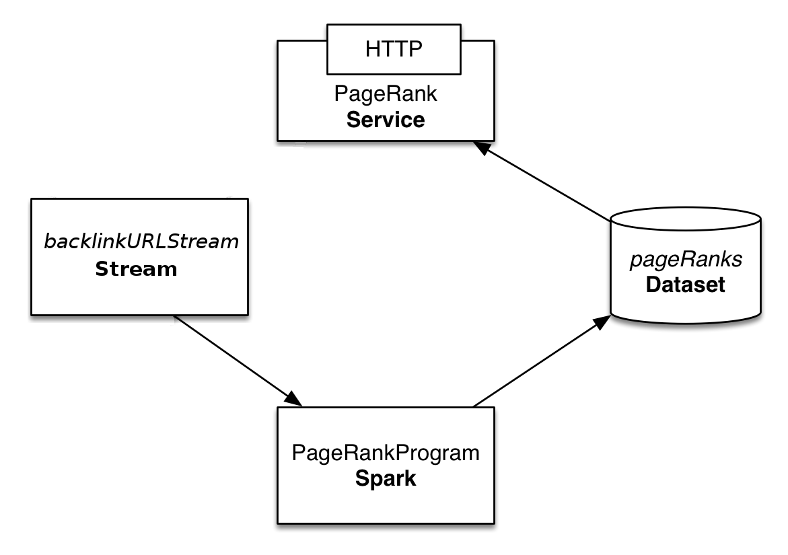

===========================================
Iterative Data Processing with Apache Spark
===========================================

`Apache Spark <https://spark.apache.org/>`__ is a very popular engine to
perform in-memory cluster computing for Apache Hadoop. In this guide,
you will learn how to run Apache Spark programs with CDAP.

What You Will Build
===================

You will build a 
`CDAP application <http://docs.cdap.io/cdap/current/en/developers-manual/building-blocks/applications.html>`__
that exposes a RESTful API to take in web pages’ backlinks information and
serve out the `PageRank <http://en.wikipedia.org/wiki/PageRank>`__ for the
known web pages. You will:

- Use a
  `Stream <http://docs.cdap.io/cdap/current/en/developers-manual/building-blocks/streams.html>`__
  as the source of backlinks data;
- Build a CDAP
  `Spark <http://docs.cdap.io/cdap/current/en/developers-manual/building-blocks/spark-jobs.html>`__
  program that reads directly from the Stream and computes the PageRank of the web pages;
- Use a
  `Dataset <http://docs.cdap.io/cdap/current/en/developers-manual/building-blocks/datasets/index.html>`__
  to store the output of the Spark program; and
- Build a
  `Service <http://docs.cdap.io/cdap/current/en/developers-manual/building-blocks/services.html>`__
  to serve the PageRank computation results over HTTP.

What You Will Need
==================

- `JDK 7 <http://www.oracle.com/technetwork/java/javase/downloads/index.html>`__
- `Apache Maven 3.1+ <http://maven.apache.org/>`__
- `CDAP SDK <http://docs.cdap.io/cdap/current/en/developers-manual/getting-started/standalone/index.html>`__

Let’s Build It!
===============

The following sections will guide you through building an application from scratch. If you
are interested in deploying and running the application right away, you can clone its
source code from this GitHub repository. In that case, feel free to skip the next two
sections and jump right to the 
`Build and Run Application <#build-and-run-application>`__ section.

Application Design
------------------
Backlinks data is sent to the *backlinkURLStream* over HTTP (e.g. by a web
crawler as it processes web pages). The PageRank for known pages is
computed periodically by a *PageRankProgram*. The program uses the
*backlinkURLStream* as an input and persists the results in the
*pageRanks* dataset.

The *PageRankService* then uses the *pageRanks* dataset to serve the
PageRank for a given URL over HTTP.

In this guide we assume that the backlinks data will be sent to a CDAP
application.

Implementation
--------------
The first step is to construct the application structure. We will use a
standard Maven project structure for all of the source code files::

  ./pom.xml
  ./src/main/java/co/cask/cdap/guides/PageRankApp.java
  ./src/main/java/co/cask/cdap/guides/PageRankSpark.java
  ./src/main/java/co/cask/cdap/guides/PageRankHandler.java
  ./src/main/scala/co/cask/cdap/guides/PageRankProgram.scala

The application is identified by the ``PageRankApp`` class. This class
extends `AbstractApplication 
<http://docs.cdap.io/cdap/current/en/reference-manual/javadocs/co/cask/cdap/api/app/AbstractApplication.html>`__,
and overrides the ``configure()`` method to define all of the application components:

.. code:: java

  public class PageRankApp extends AbstractApplication {

    @Override
    public void configure() {
      setName("PageRankApp");
      addStream(new Stream("backlinkURLStream"));
      addSpark(new PageRankSpark());
      addService("PageRankService", new PageRankHandler());
      try {
        ObjectStores.createObjectStore(getConfigurer(), "pageRanks", Double.class);
      } catch (UnsupportedTypeException e) {
        throw new RuntimeException("Won't happen: all classes above are supported", e);
      }
    }
  }

In this example, we use a Stream to supply backlinks data;
the Spark program that computes the PageRank of the web pages reads directly from the Stream.
``backlinkURLStream`` receives backlinks information in the form of two URLs separated by whitespace:

.. code:: console

  http://example.com/page1 http://example.com/page10

We’ll use Scala to write the Spark program (for an example of using Java, refer to the `CDAP SparkPageRank
example <http://docs.cask.co/cdap/current/en/examples-manual/examples/spark-page-rank.html>`__).
You’ll need to add ``scala`` and ``maven-scala-plugin`` as dependencies in
your Maven `pom.xml 
<https://github.com/cdap-guides/cdap-spark-guide/blob/develop/pom.xml>`__.

The code below configures Spark in CDAP. This class extends
`AbstractSpark <http://docs.cdap.io/cdap/current/en/reference-manual/javadocs/co/cask/cdap/api/spark/AbstractSpark.html>`__
and overrides the ``configure()`` method to define all of the components. The
``setMainClassName`` method sets the Spark Program class which CDAP will run:

.. code:: java

  public class PageRankSpark extends AbstractSpark {

    @Override
    public void configure() {
      setName(PageRankSpark.class.getSimpleName());
      setDescription("Spark program to compute PageRank");
      setMainClass(PageRankProgram.class);
    }
  }

The ``PageRankProgram`` Spark program does the actual page rank
computation. This code is taken from the `Apache Spark's PageRank example 
<https://github.com/apache/spark/blob/master/examples/src/main/scala/org/apache/spark/examples/SparkPageRank.scala>`__;
the Spark program stores the computed PageRank in an ObjectStore
Dataset where the key is the URL and the value is the computed PageRank:

.. code:: java

  class PageRankProgram extends ScalaSparkProgram {

    private final val ITERATIONS_COUNT: Int = 10

    override def run(sc: SparkContext) {
      val lines: RDD[(Array[Byte], Text)] = sc.readFromStream("backlinkURLStream", classOf[Text])
      val links = lines.map { s =>
        val parts = s._2.toString.split("\\s+")
        (parts(0), parts(1))
      }.distinct().groupByKey().cache()

      var ranks = links.mapValues(v => 1.0)

      // Calculate the PageRanks
      for (i <- 1 to ITERATIONS_COUNT) {
        val contribs = links.join(ranks).values.flatMap { case (urls, rank) =>
          val size = urls.size
          urls.map(url => (url, rank / size))
        }
        ranks = contribs.reduceByKey(_ + _).mapValues(0.15 + 0.85 * _)
      }

      val output = ranks.map(x => (Bytes.toBytes(x._1), x._2))

      sc.writeToDataset(output, "pageRanks", classOf[Array[Byte]], classOf[java.lang.Double])
    }
  }

To serve results out via HTTP, add a ``PageRankHandler``, which
reads the PageRank for a given URL from the ``pageRanks`` dataset:

.. code:: java

  public class PageRankHandler extends AbstractHttpServiceHandler {

    @UseDataSet("pageRanks")
    private ObjectStore<Double> pageRanks;

    @Path("pagerank")
    @POST
    public void handleBackLink(HttpServiceRequest request, HttpServiceResponder responder) {

      ByteBuffer requestContents = request.getContent();
      if (requestContents == null) {
        responder.sendError(HttpResponseStatus.NO_CONTENT.code(), "No URL provided.");
        return;
      }

      String urlParam = Charsets.UTF_8.decode(requestContents).toString();

      Double rank = pageRanks.read(urlParam);
      if (rank == null) {
        responder.sendError(HttpResponseStatus.NOT_FOUND.code(), "The following URL was not found: " + urlParam);
        return;
      }

      responder.sendJson(String.valueOf(rank));
    }
  }

Build and Run Application
=========================

The ``PageRankApp`` application can be built and packaged using the Apache Maven command::

  $ mvn clean package

Note that the remaining commands assume that the ``cdap-cli.sh`` script is
available on your PATH. If this is not the case, please add it::

  $ export PATH=$PATH:<CDAP home>/bin

If you haven't already started a standalone CDAP installation, start it with the command::

  $ cdap.sh start

You can then deploy the application to a standalone CDAP installation::

  $ cdap-cli.sh deploy app target/cdap-spark-guide-<version>.jar

Start the Service::

  $ cdap-cli.sh start service PageRankApp.PageRankService 

Send some Data to the Stream::

  $ cdap-cli.sh send stream backlinkURLStream \'http://example.com/page1 http://example.com/page1\'
  $ cdap-cli.sh send stream backlinkURLStream \'http://example.com/page1 http://example.com/page10\'
  $ cdap-cli.sh send stream backlinkURLStream \'http://example.com/page10 http://example.com/page10\'
  $ cdap-cli.sh send stream backlinkURLStream \'http://example.com/page10 http://example.com/page100\'
  $ cdap-cli.sh send stream backlinkURLStream \'http://example.com/page100 http://example.com/page100\'

Run the Spark Program::

  $ cdap-cli.sh start spark PageRankApp.PageRankSpark

The Spark Program can take time to complete. You can check the status
for completion using::

  $ cdap-cli.sh get spark status PageRankApp.PageRankSpark

Query for the PageRank results::

  $ cdap-cli.sh call service PageRankApp.PageRankService GET 'pagerank?url=http://example.com/page1'

Example output::

  +====================================================================================+
  | status | headers                                  | body size | body               |
  +====================================================================================+
  | 200    | Content-Length : 18                      | 18        | 0.2610116705534049 |
  |        | Content-Type : text/plain; charset=utf-8 |           |                    |
  |        | Connection : keep-alive                  |           |                    |
  +====================================================================================+

Congratulations! You have now learned how to incorporate Spark programs
into your CDAP applications. Please continue to experiment and extend
this sample application.

Share and Discuss!
==================

Have a question? Discuss at the `CDAP User Mailing List <https://groups.google.com/forum/#!forum/cdap-user>`__.

License
=======

Copyright © 2014-2015 Cask Data, Inc.

Licensed under the Apache License, Version 2.0 (the "License"); you may
not use this file except in compliance with the License. You may obtain
a copy of the License at

http://www.apache.org/licenses/LICENSE-2.0

Unless required by applicable law or agreed to in writing, software
distributed under the License is distributed on an "AS IS" BASIS,
WITHOUT WARRANTIES OR CONDITIONS OF ANY KIND, either express or implied.
See the License for the specific language governing permissions and
limitations under the License.
